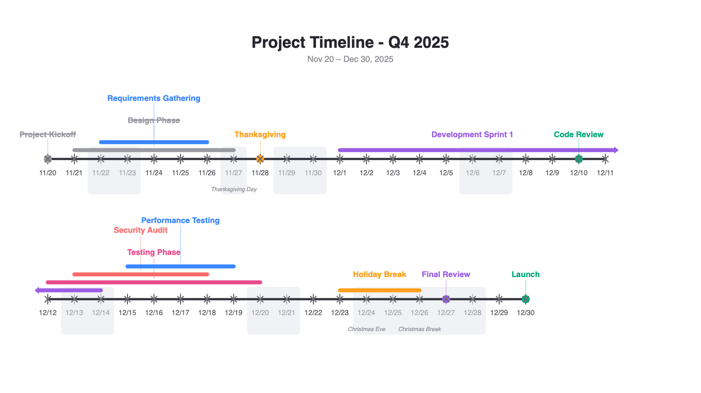

# Timeline

A native Mac app for creating timeline PDFs and images. Edit events in a
form, watch the timeline render live, and export to PDF or PNG.

<picture>
  <source media="(prefers-color-scheme: dark)" srcset="docs/example-dark.png">
  
</picture>

## Features

- **Live preview** — the timeline re-renders as you type, with pinch
  zoom and panning; follows the system light/dark appearance
- **Point & range events** — dots for single days, bars for ranges;
  events sharing a day split the dot into half-circles
- **Smart layout** — wraps long timelines across rows, stacks
  overlapping ranges, and keeps labels from colliding (leader lines
  connect raised labels to their markers)
- **Weekends & holidays** — US federal holidays and weekends are shaded
  with names printed under the dates; add custom holidays, or turn
  shading off
- **Color palettes** — bright (default), muted, and jewel palettes;
  colors assign chronologically so neighboring events never match, with
  per-event overrides
- **Done events** — struck through and grayed out
- **Export** — paged PDF (US letter, landscape) or single PNG at up to
  288 dpi

## Installing

Grab **Timeline.zip** from the latest GitHub release, unzip, and drag
Timeline.app to Applications. Builds are ad-hoc signed: right-click →
Open on first launch.

Releases are cut by pushing a version tag:

```bash
git tag v1.0.0 && git push origin v1.0.0
```

## Building from source

Requires Xcode command line tools (Swift 6).

```bash
make app       # build build/Timeline.app
make run-app   # build and launch
make test      # run the self-test suite
```

## Documents

The app saves `.timeline` files — plain YAML, friendly to version
control (existing `.yaml` configs open via File > Open):

```yaml
title: "Project Timeline"
timeline_start: "2026-06-08"   # optional; defaults to today
timeline_end: "2026-07-20"     # optional; defaults to the last event
days_per_row: 22               # optional; days per timeline row
shade_weekends: true           # optional; default true
shade_holidays: true           # optional; default true
palette: "bright"              # optional; bright | muted | jewel | ocean |
                               #   sunset | forest, or a custom color list:
                               #   palette: ["#D62828", "#003049", "#588157"]

custom_holidays:
  - start: "2026-07-08"
    end: "2026-07-09"
    name: "Lab Retreat"

events:
  - name: "Submit Paper"
    start: "2026-06-18"
  - name: "Family Visiting"
    start: "2026-07-01"
    end: "2026-07-07"
  - name: "Big Deadline"
    start: "2026-06-18"
    important: true            # boxed label
  - name: "Finished Task"
    start: "2026-06-09"
    done: true
    color: "#3A86FF"           # optional override
```

See [example.timeline](example.timeline) for a fuller example.

## Headless rendering

The app binary doubles as a CLI for scripting and CI:

```bash
TimelineApp/.build/release/TimelineApp --render events.timeline out.pdf
TimelineApp/.build/release/TimelineApp --render events.timeline out.png
```
